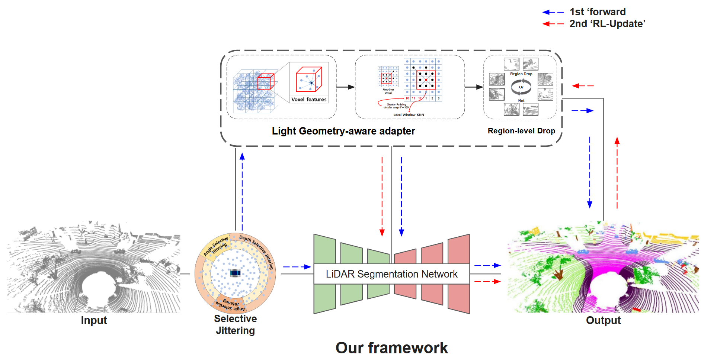

   
  
# Source-Only-Cross-Weather-LiDAR-via-Geometry-Aware-Point-Drop

# News
- [2026/02/01]: 🎉 Our paper has been accepted to the IEEE International Conference on Robotics and Automation (ICRA).
 

# Abstract
LiDAR semantic segmentation degrades in adverse weather because refraction, scattering, and point dropouts corrupt geometry. Prior work, including weather simulation, mixing-based augmentation, domain randomization, and uncertainty or boundary regularization, improves robustness but still overlooks structural vulnerabilities near boundaries, corners, and sparse regions. We present a Light Geometry-aware adapter. The module aligns azimuth and applies horizontal circular padding to preserve neighbor continuity across the 0◦-360◦ wrap-around boundary. A local-window K-Nearest Neighbors gathers nearby
points and computes simple local statistics, which are compressed into compact geometry-aware cues. During training, these cues drive region-aware regularization that stabilizes predictions in structurally fragile areas. The adapter is plug-and-play, complements augmentation, and can be enabled only
during training with negligible inference cost. We adopt a source-only cross-weather setup where models train on SemanticKITTI and are evaluated on SemanticSTF without target labels or fine-tuning. The adapter improves mIoU by +3.4% over the data-centric augmentation baseline and by +0.3% over the class-centric regularization baseline. These results indicate that geometry-driven regularization is a keydirection for all-weather LiDAR segmentation.

# Methods

# Getting Started
